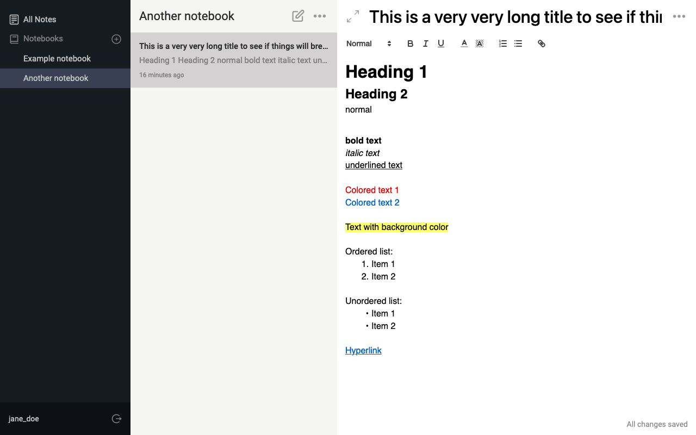
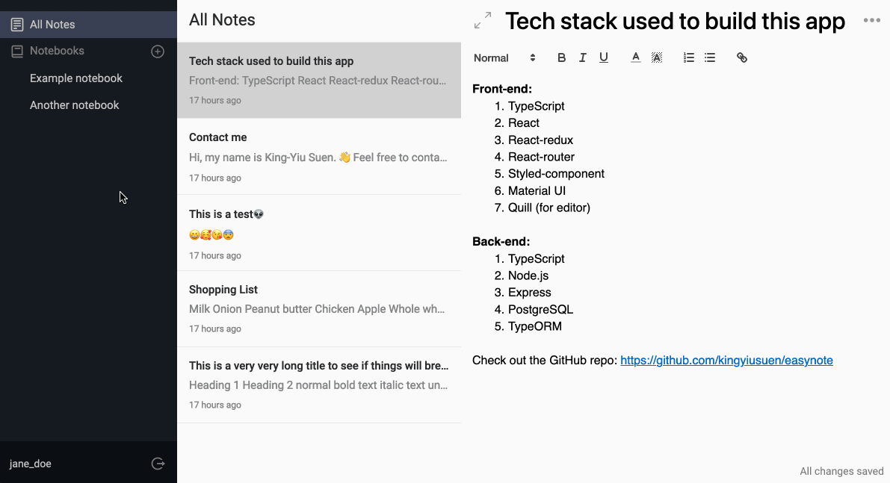
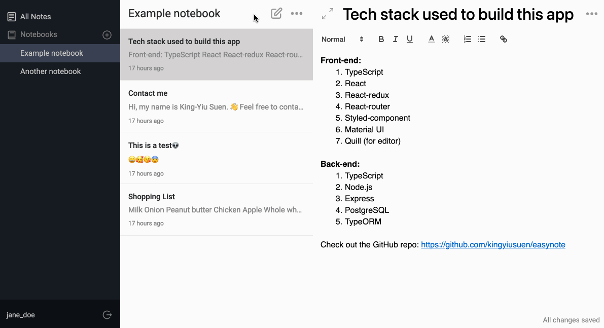
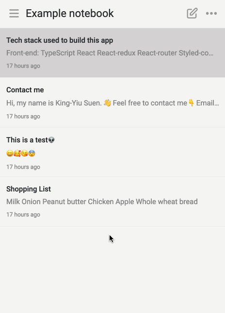
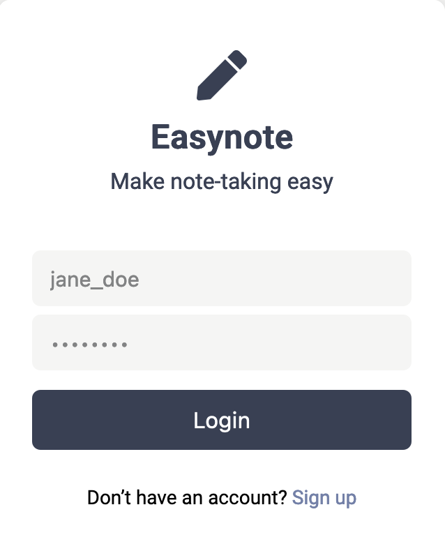

# Easynote

[](https://github.com/kingyiusuen/easynote/blob/master/LICENSE)

Easynote is a single-page note-taking application that features a rich text editor.

(Live Demo: [https://easynote-ksuen.herokuapp.com/](https://easynote-ksuen.herokuapp.com/))



## Technologies

- TypeScript in both frontend and backend
- React for frontend
- Redux for state management
- Axios for making HTTP requests
- Styled-component and [MUI](https://mui.com/) for styling
- [Quill](https://quilljs.com/) for WYSIWYG editor
- Node.js and Express for backend
- PostgreSQL for storing user information and notes
- [TypeORM](https://typeorm.io/) for automating object-to-table and table-to-object conversion

## Features

### Notebooks



Users can organize their notes with notebooks. To create a new notebook, click the "+" button in the sidebar. To view the notes within a notebook, click the notebook name in the sidebar. The notes are sorted by last updated time in descending order. To rename and delete a noteobok, click the "more action" button (shown as three dots) in the header of the note list.

---

### Notes



Easynote features a rich text editor powered by [Quill](https://quilljs.com/), which allows users to use different heading levels, font sizes and colors, etc. Notes are autosaved as soon as the user stops typing. There is a sync indicator in the bottom right corner of the editor.

Users can move the note to a different notebook and delete the note permenantly by choosing the corresponding options in the "more action" button in the top right corner of the editor.

Users can also toggle between full screen and normal display modes.

---

### Mobile Responsive



Easynote is mobile responsive with the help of CSS media queries.

---

### Authentication



User passwords are encrpyted using [bcrypt](https://www.npmjs.com/package/bcrypt) before they are stored in the database.
When a user is logged in, the server will send a JWT token to the client. The token will be stored in the localStorage of the client's browser. On every page reload, the website will check whether an unexpired JWT token exists in localStorage and authenticate the user automatically. Therefore, users don't need to login again even after they close the webpage. The token is included in the authorization header of every HTTP request. The server uses [passport.js](http://www.passportjs.org/) to authenticate the token.

## Planned Features

- Pin notes
- Search notes
- Change sort order
- Change password
- Refresh token

## Installation

- Clone the repo.
- Run `npm install` to install dependencies for the server.
- Run `cd client` and then `npm install` to install dependencies for the client.

## Local Development

- Install PostgreSQL.
- Create a `.env` file. Put in a secret key following the format of `.env.example`.
- Run `npm run client` to start the client.
- Run `npm run server` to start the server.
- Run `npm run dev` to start the client and the server concurrently.

## Deploy to Heroku

Install [Heroku CLI](https://devcenter.heroku.com/articles/heroku-cli).

Login to your Heroku account.

```
heroku login
```

Create a new Heroku app.

```
heroku create <YOUR_APP_NAME>
```

Setup Heroku Postgres Database. This should return a `DATABASE_URL`.

```
heroku addons:create heroku-postgresql:hobby-dev --app <YOUR_APP_NAME>
```

By default, Heroku will strip out the packages declared under devDependencies before deploying the application. However, Heroku will need the type definition packages `@types/*` to build the app with the `tsc` TypeScript compiler, so we need to disable this option.

```
heroku config:set NPM_CONFIG_PRODUCTION=false
```

Add JWT secret key as an environment variable

```
heroku config:set JWT_SECRET=<YOUR_SECRET_KEY>
```
